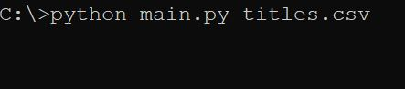

# Csv2mp3

## Index:

- [Introduction](#introduction)
- [Sample of input](#sample-of-input)
- [How to use it](#how-to-use-it)
- [License](#licese)
- [Copyright](#copyright)
- [Releases](https://github.com/lampaDario1543/csv2mp3/releases)

---

## Introduction:

This python program take a CSV file in input with songs, artist and album, and return a folder with the songs downloaded in .mp3 (quality 124 kbps), it inserts autmatically these mp3 tags:

- Title
- Artist
- Album
- Year
- Number of Track
- Album Cover

Example:

---

## Sample of input:

The CSV file needs to contain 3 fields: title, artist and album, and then you can add how many rows do you want.

E.G.

`titles.csv`

| title                    | artist          | album                      |
| ------------------------ | --------------- | -------------------------- |
| Never Gonna Give You Up  | Rick Astley     | Whenever You Need Somebody |
| I'm gonna Be (500 Miles) | The Proclaimers | Sunshine on Leith          |

---

## How to use it:

#### From source code:

First of all, you have to download `requirements.txt` file from [here](https://github.com/lampaDario1543/csv2mp3/blob/db3bb1fa00f71906da601a9c934766eda2291c84/requirements.txt) after that you have to run this command in your environment `pip install -r requirements.txt`, this will install all the libraries the program needs.

To use the program, simply run the command `python main.py file_path.csv` and provide the path to the CSV file as a command-line argument, if you don't, the program will detect that and will ask you for the path of the CSV file. The program will generate a folder on the desktop called `csv2mp3`, with other subfolders that are the names of the albums in the CSV file, in the folder there will be the mp3 file and an image `thumb.jpg`, which is the album cover.

#### From release:

If you don't want to download the source code, you can download a release from [here](https://github.com/lampaDario1543/csv2mp3/releases), you can download the `setup.exe`, after you have downloaded it you've to run it and it will install the program in your program folder. After the program is installed you can run it and it will ask you the CSV path, insert it and it will start to download your songs.

E.G.

`titles.csv`

⚠ It's important to give administrator permissions to the program, because when you run it creates `.cache` file for spotipy library, and needs admin permissions to edit and create it.

## License:

MIT License

Copyright **©** 2023 Lampa_Dario1543

For more info `license.txt` ([here](https://github.com/lampaDario1543/csv2mp3/blob/db3bb1fa00f71906da601a9c934766eda2291c84/license.txt))

## Copyright

Copyright **©** 2023 Lampa_Dario1543
