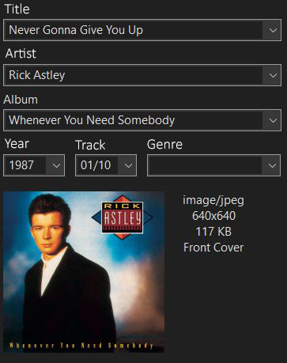

# Csv2mp3

## Index:

- [Introduction](#intro)
- [Sample of input](#sample)
- [Releases](https://github.com/lampaDario1543/csv2mp3/releases)

---

## Introduction:

This python program take a CSV file in input with songs, artist and album, and return a folder with the songs downloaded in .mp3 (quality 124 kbps), it inserts autmatically all mp3 tags:

- Title
- Artist
- Album
- Year
- Number of Track
- Album Cover

Example:

To use the program, simply run the command `python main.py file_path.csv` and provide the path to the CSV file as a command-line argument, if you don't, the program will detect that and will ask you for the path of the CSV file. The program will generate a folder on the desktop called `csv2mp3`, with other subfolders that are the names of the albums in the CSV file, in the folder there will be the mp3 file and an image `thumb.jpg`, that's the album cover.

## Sample of input:

The CSV file needs to contain 3 fields: title, artist and album, and then you can add how many rows do you want.

E.G.

| title                    | artist          | album                      |
| ------------------------ | --------------- | -------------------------- |
| Never Gonna Give You Up  | Rick Astley     | Whenever You Need Somebody |
| I'm gonna Be (500 Miles) | The Proclaimers | Sunshine on Leith          |

# TO BE FINISHED
